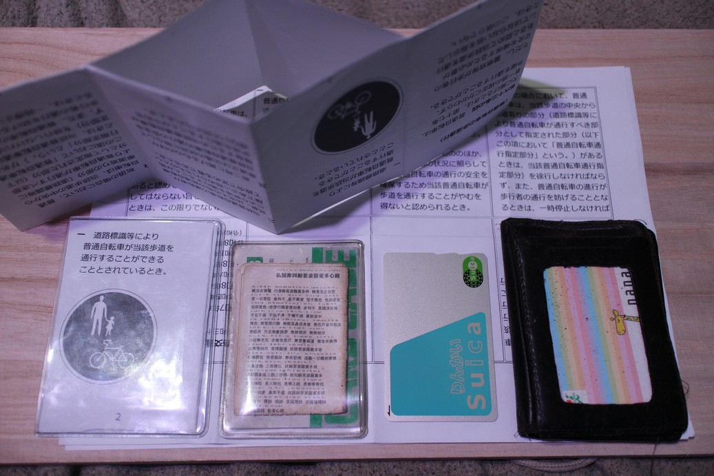
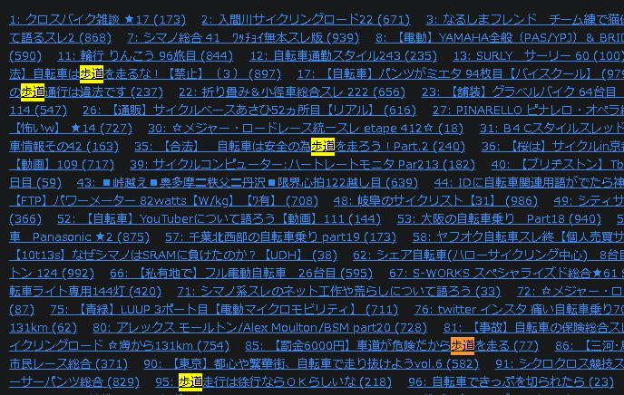

<!-- 
・自分で作ったWebページをインターネット上に公開しよう！ https://prog-8.com/docs/github-pages
・GitHub 上でフォルダ（ディレクトリ）を作成する方法 https://zenn.dev/kazuk_super/articles/setouchi-h-how-to-create-folder-on-github 2025/05/27 — 手順 · 「Add file」→「Create new file」を選択 · 新しいファイル名に フォルダ名/ファイル名 を入力たとえば、 test/test.md と入力すると test ...
・github pages file name _ GitHub Pagesで先頭がアンダースコア（_）で始まるファイルやディレクトリ（例: _css/, _files/）は、Jekyllの処理対象（通常は無視）と見なされ、Redditの投稿によるとWebサイト上で公開・表示されません。
・Markdown記法 チートシート https://qiita.com/Qiita/items/c686397e4a0f4f11683d#%E6%95%B0%E5%BC%8F%E3%81%AE%E8%A8%98%E8%BF%B0%E6%96%B9%E6%B3%95
  ・な～～んかMarkdownうまくいかない印象なんだが・・
-->
URL: http://kensuke.github.io/misc/bicycles/<br />
（＊ 編集中 github(Codes) / io(Web Pages) 併用について難航中。 CodesでREADME.mdを編集して、Webへアクセスする、、と思う ＊）<br />

# ２０２６年４月　道路交通法改正　特に自転車の歩道通行
<br />

### について
- 警察庁の発表
  - をもとにしたマスコミ報道
    - をもとにしたネット民の反応

すべてにおいて納得いかないので、緊急立ち上げ（２０２６年１月末ごろ～）。
<br />
<br />

### ４月以降どうすんの？
これまで通り。
- ノーヘル
- 原則歩道通行
- 無保険（他保険での特約等もなし）
  - 県の条例違反・・（自転車保険加入義務）
- ＢＤ－１
  - １８インチなので、そもそもスピードを出しにくい

これといって、どうもしない
<br />
<br />

### ファイル構成
- [ルールブック](on_sidewalks.html) 第六十三条の四を抜粋したもの<!--  - [html](https://github.com/kensuke/misc/blob/master/bicycles/on_sidewalks.html) （Pagesだとprivateになってしまう？ 課金？ / hubだとWebではなくhtmlソースとして解釈してしまう・・）-->
- [印刷用PDF](on_sidewalks.pdf) <!--（Ｗｅｂでhtmlを直接編集すると、（ローカルでやってる）ＰＤＦの更新が追い付かないｗ）--><!--  - [pdf](https://github.com/kensuke/misc/blob/master/bicycles/on_sidewalks.pdf) -->
<br />
<br />


Ａ７サイズケース、Ｂ８サイズケース（＋ポケット般若心経）、Ｓｕｉｃａ（りんかい）、定期入れ（物理）

### 使い方
1. ＰＤＦを印刷します<br />
   1-1. コンビニとかで
2. 半分 半分 半分と折り曲げ、切り込み、冊子にします<br />
   2-1. [1枚の用紙で小冊子をつくる](https://manuals.ricoh.com/driver/rpcsv4/help/jp/HTMLFILE/IDH_HOW_Pamphlet.htm)（リコー）
3. A7サイズのカードケースへ入れ、でかけるときのバッグへ常備します<br />
   3-1. [軟質カードケースＡ７サイズ](https://jp.daisonet.com/products/4550480305844)（ダイソー）
4. 自転車で歩道を安全通行します<br />
   4-1. 自転車通行可の標識を確認しましょう！！ 大抵あるはず<br />
        4-1-1. 標識がない場合は・・。結構厳しいと思う。一応「だって車道危ないじゃん」にも対応しているはずだが、
5. 職質されたら自家製ルールブックを印籠にして、「道交法 ６３条４の１で標識がある場合は～～」
<br />

### 注意事項
- 「はい論破ｗｗ」とか禁止
-  職質時は録画がベター
-  警官の高圧的な態度に納得いかないとは思いますが、
<br />

### ネット民の反応
- [リアルタイム検索](https://search.yahoo.co.jp/realtime/search?p=%E8%87%AA%E8%BB%A2%E8%BB%8A%20%E6%AD%A9%E9%81%93)
<br />



めまいがする・・

### リンク
- [道路交通法](https://laws.e-gov.go.jp/law/335AC0000000105)
  - [道路交通法の一部改正（令和6年5月24日法律第34号　公布の日から起算して6月を超えない範囲内において政令で定める日から施行　※令和6年9月4日（政令第271号）において令和6年11月1日からの施行となりました）](https://www.sn-hoki.co.jp/article/pickup_hourei/pickup_hourei3613150/)
  - [道路交通法施行令](https://lawzilla.jp/law/335CO0000000270?n=ln26)
- [警察庁 自転車の安全利用の促進](https://www.npa.go.jp/bureau/traffic/bicycle/index.html)
  - [「自転車を安全・安心に利用するために」（自転車ルールブック）の作成について](https://www.npa.go.jp/bureau/traffic/bicycle/pdf/rulebook.pdf)
<br />

### ルールブックおかしいだろ

> 単に歩道を通行しているといった違反（ルールブック p.6）<br />

は？？<br />
<br />


> 歩道で車道寄りを通行しなければいけないのはなぜ？（ルールブック p.18）<br />
> （略）<br />
> ブレーキをかける時間を確保<br />

（笑）<br />
（あとで書く）<br />

この２点に関して指摘・連絡済み
<br />

### ごちゃまぜ（未整理）
```
自転車の定義
第二条　この法律において、次の各号に掲げる用語の意義は、それぞれ当該各号に定めるところによる。
十一　軽車両　次に掲げるものであつて、移動用小型車、身体障害者用の車及び歩行補助車等以外のもの（遠隔操作（車から離れた場所から当該車に電気通信技術を用いて指令を与えることにより当該車の操作をすること（当該操作をする車に備えられた衝突を防止するために自動的に当該車の通行を制御する装置を使用する場合を含む。）をいう。以下同じ。）により通行させることができるものを除く。）をいう。
イ　自転車、荷車その他人若しくは動物の力により、又は他の車両に牽けん引され、かつ、レールによらないで運転する車（そり及び牛馬を含み、小児用の車（小児が用いる小型の車であつて、歩きながら用いるもの以外のものをいう。次号及び第三項第一号において同じ。）を除く。）
ロ　原動機を用い、かつ、レール又は架線によらないで運転する車であつて、車体の大きさ及び構造を勘案してイに準ずるものとして内閣府令で定めるもの
十一の二　自転車　ペダル又はハンド・クランクを用い、かつ、人の力により運転する二輪以上の車（レールにより運転する車を除く。）であつて、身体障害者用の車、小児用の車及び歩行補助車等以外のもの（原動機を用いるものにあつては、人の力を補うため原動機を用いるものであつて内閣府令で定める基準に該当するものを含み、移動用小型車及び遠隔操作により通行させることができるものを除く。）をいう。

児童、幼児
（目が見えない者、幼児、高齢者等の保護）
第十四条　目が見えない者（目が見えない者に準ずる者を含む。以下同じ。）は、道路を通行するときは、政令で定めるつえを携え、又は政令で定める盲導犬を連れていなければならない。
３　児童（六歳以上十三歳未満の者をいう。以下同じ。）若しくは幼児（六歳未満の者をいう。以下同じ。）を保護する責任のある者は、交通のひんぱんな道路又は踏切若しくはその附近の道路において、児童若しくは幼児に遊戯をさせ、又は自ら若しくはこれに代わる監護者が付き添わないで幼児を歩行させてはならない。

車道
（特例特定小型原動機付自転車等の路側帯通行）
（通行区分）
第十七条　車両は、歩道又は路側帯（以下この条及び次条第一項において「歩道等」という。）と車道の区別のある道路においては、車道を通行しなければならない。ただし、道路外の施設又は場所に出入するためやむを得ない場合において歩道等を横断するとき、又は第四十七条第三項若しくは第四十八条の規定により歩道等で停車し、若しくは駐車するため必要な限度において歩道等を通行するときは、この限りでない。
第十七条の三　特例特定小型原動機付自転車及び軽車両は、第十七条第一項の規定にかかわらず、著しく歩行者の通行を妨げることとなる場合を除き、道路の左側部分に設けられた路側帯（特例特定小型原動機付自転車及び軽車両の通行を禁止することを表示する道路標示によつて区画されたものを除く。）を通行することができる。
２　前項の場合において、特例特定小型原動機付自転車及び軽車両は、歩行者の通行を妨げないような速度と方法で進行しなければならない。
（罰則　第二項については第百二十一条第一項第八号）

（普通自転車の歩道通行）
第六十三条の四　普通自転車は、次に掲げるときは、第十七条第一項の規定にかかわらず、歩道を通行することができる。ただし、警察官等が歩行者の安全を確保するため必要があると認めて当該歩道を通行してはならない旨を指示したときは、この限りでない。
一　道路標識等により普通自転車が当該歩道を通行することができることとされているとき。
二　当該普通自転車の運転者が、児童、幼児その他の普通自転車により車道を通行することが危険であると認められるものとして政令で定める者であるとき。
三　前二号に掲げるもののほか、車道又は交通の状況に照らして当該普通自転車の通行の安全を確保するため当該普通自転車が歩道を通行することがやむを得ないと認められるとき。
２　前項の場合において、普通自転車は、当該歩道の中央から車道寄りの部分（道路標識等により普通自転車が通行すべき部分として指定された部分（以下この項において「普通自転車通行指定部分」という。）があるときは、当該普通自転車通行指定部分）を徐行しなければならず、また、普通自転車の進行が歩行者の通行を妨げることとなるときは、一時停止しなければならない。ただし、普通自転車通行指定部分については、当該普通自転車通行指定部分を通行し、又は通行しようとする歩行者がないときは、歩道の状況に応じた安全な速度と方法で進行することができる。
（罰則　第二項については第百二十一条第一項第八号）

２－１１）自転車は軽車両
　　　　　　軽車両は車両
　　　　１７）車両は車道

自転車の歩道通行を・・
　許す
６３－４－１）歩道通行可の標識あり　←　これがわかりやすいかなと
６３－４－２）年齢　１３歳未満・７０歳以上、施行令２６条？？（ってなに？ 背景か？）
６３－４－３）やむを得ない場合　←　知らんけど・・って感じ
　許さない
６３－４）ただし警官の指示が優先　←　これもなんか
```

### あとでやる
- Ｂ８サイズ化？
- レスポンシブデザイン（やらない）
- 背景、経緯等
