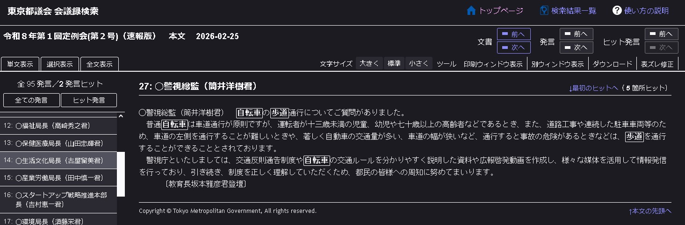

ウーバーのせいで歩道走行可の標識が撤去された！との怪情報（要確認）があり、実際に都内の標識がサイレント撤去されている（要確認）（ストビューで探してるんだが、どこかないかな～）らしく、都議会で、歩道走行可の標識撤去についてなにかないか？と検索していたら・・、

> ◯警視総監（筒井洋樹君）　自転車の歩道通行についてご質問がありました。 
> 普通自転車は車道通行が原則ですが、 
> ・運転者が十三歳未満の児童、幼児や七十歳以上の高齢者などであるとき 
> ・道路工事や連続した駐車車両等のため、車道の左側を通行することが難しいときや、著しく自動車の交通量が多い、車道の幅が狭いなど、通行すると事故の危険があるとき 
> ・など 
> は、歩道を通行することができることとされております。 

（改行、リスト化の編集済）

https://www.record.gikai.metro.tokyo.lg.jp/283806?Template=document&Id=19970#one:27

標識は「など」？ｗｗｗｗ この流れで標識が出てこないのはおかしいだろ。わざとだろな
 
 

警視総監の情けない答弁

> 警視）など 
> 条文）一　道路標識等により普通自転車が当該歩道を通行することができることとされているとき。 
 

> 警視）運転者が十三歳未満の児童、幼児や七十歳以上の高齢者などであるとき 
> 条文）二　当該普通自転車の運転者が、児童、幼児その他の普通自転車により車道を通行することが危険であると認められるものとして政令で定める者であるとき。 
 

> 警視）道路工事や連続した駐車車両等のため、車道の左側を通行することが難しいときや、著しく自動車の交通量が多い、車道の幅が狭いなど、通行すると事故の危険があるとき 
> 条文）三　前二号に掲げるもののほか、車道又は交通の状況に照らして当該普通自転車の通行の安全を確保するため当該普通自転車が歩道を通行することがやむを得ないと認められるとき。 

逮捕したほうがいいと思う。

https://ja.wikipedia.org/wiki/%E7%AD%92%E4%BA%95%E6%B4%8B%E6%A8%B9
東京大学法学部を卒業

----

- [警察に指導・警告を受けたり青切符を切られたら報告](https://itest.5ch.io/medaka/test/read.cgi/bicycle/1774972096/10) （５ちゃん 自転車板）

> 0010 ツール・ド・名無しさん 2026/04/01(水) 13:23:49.53 
> ウーバー問題で「普通自転車歩道通行可」は撤去されました。 
> 「普通自転車歩道通行可」の標識が撤去された主な路線（取締強化路線） 
> 玉川通り（国道246号線） 
> 目黒通り（都道312号白金台町等々力線） 
> 旧山手通り（都道317号支線） 
> 山手通り支線（都道317号支線）（菅刈陸橋下から大橋交差点） 
> 環七通り（都道318号環状六号線） 
> 駒沢通り（都道416号古川橋二子玉川線） 
> 都道補助26号線（都道420号鮫洲大山線） 
> 淡島通り（都道423号線） 
> 自由通り（都道426号線）の一部（駒沢公園前） 
> 都道補助46号線 
> 西郷山通りの一部（菅刈公園から区営青葉台一丁目アパート前） 
> 柳通り 
> 野沢通りの一部（西郷山下交差点から蛇崩交差点先） 
> 東山いちょう通り 
> 中町通りの一部（中町二丁目交差点から中央緑地公園北口先） 
> 田向通りの一部（碑文谷警察裏先から田向公園） 
> 碑さくら通り 
> サレジオ通りの一部（碑文谷交差点からサレジオ教会先） 
> 碑文谷八幡通り（大岡山小学校前から立会川緑道入口）  

ウーバーはともかく、ストビューを・・（あとでやる）
