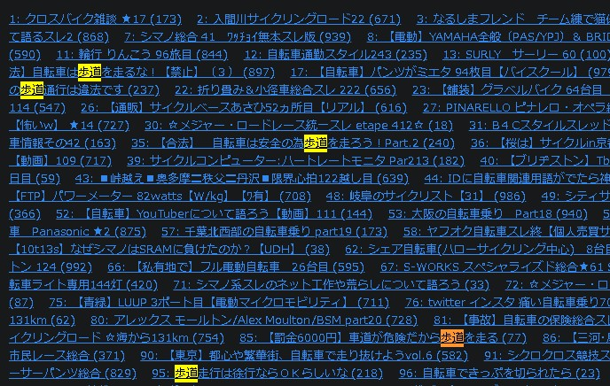
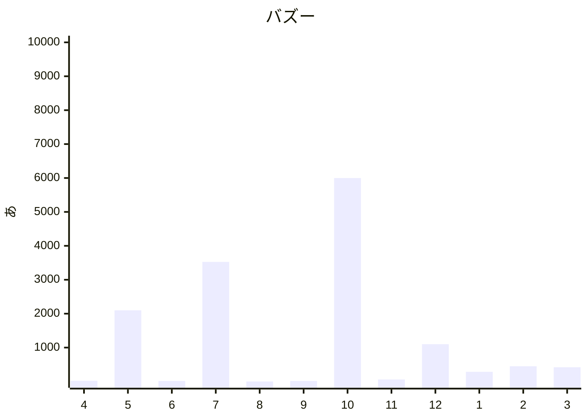

URL: [http://kensuke.github.io/misc/bicycles/](http://kensuke.github.io/misc/bicycles/) > [R_netmin.html](http://kensuke.github.io/misc/bicycles/R_netmin.html)

# インターネットが終わってる１０つの理由

### Ｘ
- [リアルタイム X検索 自転車 歩道](https://search.yahoo.co.jp/realtime/search?p=%E8%87%AA%E8%BB%A2%E8%BB%8A%20%E6%AD%A9%E9%81%93) 
めまいがする・・ 
が、たまに見たくなるから困る・・ｗ

### ５ちゃん終わったな
  
コピペ、書き込みのたびにＩＤチェーンジ、キャッチボールにならないやりとり、 
 
ネットってほんのりと反体制な印象がある（もしくは、そういうやつの声がやたらでかいｗ（もしくは賛成多数の反対））。で、この手のお上からの強制みたいなものがあったときに、みんながみんな体制側批判に回るのではなく、賛成と反対に分かれる。そりゃ一枚岩じゃないっていえばそうだけど、なんかこう違和感がある。賛成・反対どちらでもなく、ネット上でのロールプレイをやってるように見える・・って感じ。
 

・・ほんとに.net終わってしまった・・ｗｗ

### どーが（終わってない）
- [世に溢れる自転車青切符の「ウソ」を正します。施行まで1ヶ月切ったのに、世は「歩道通行で罰金6000円」だらけ。だから違うんだって。品行方正な自転車乗りには今まで通り青切符は切られません。](https://www.youtube.com/watch?v=Jv6oiWiBvM4)（芝浦自転車研究所 自転車ツーキニスト 疋田 智）
  - 疋田氏の動画はよいが、コメント欄が低い
- [楽しむための自転車学2026夏 いよいよやてきた自転車青切符時代、安全快適に乗るにはどうすればいいでしょう](https://g-sakura-academy.jp/course/detail/332)（学習院大学 さくらアカデミー）
  - 以前（コロナ禍）はＺｏｏｍでやってたんだけど、もうないのかな？ ネットでいう「じじ」がバリバリリモート会議やってた。ネット民「ジジババはＰＣが～スマホが～」

### 天才インフルエンサー
<!-- 
https://twitter.com/hiiragi2280/status/1915870942179561646
震源地・・なのかなあ？
-->

 
（これ６０００万が外れ値すぎて、意味わからなくなってるなｗ）

<!--
5/10 https://x.com/hiiragi2280/status/1920944381940691452
5/31 https://x.com/hiiragi2280/status/1928554516041052196
6/ 5 https://x.com/hiiragi2280/status/1930366467272552662
6/ 8 https://x.com/hiiragi2280/status/1931453620408709213
6/12 https://x.com/hiiragi2280/status/1932903213298331971
6/13 https://x.com/hiiragi2280/status/1933265566896435715
6/17 https://x.com/hiiragi2280/status/1934833127027093791
6/18 https://x.com/hiiragi2280/status/1935077497307353418
7/10 https://x.com/hiiragi2280/status/1943050036071534997
7/28 https://x.com/hiiragi2280/status/1949573020114403549
9/18 https://x.com/hiiragi2280/status/1968417252627341421
9/19 https://x.com/hiiragi2280/status/1968779672889815300
9/24 https://x.com/hiiragi2280/status/1970591514515608027
そして伝説へ・・
10/5 https://x.com/hiiragi2280/status/1974577780399722558
10/23 https://x.com/hiiragi2280/status/1981100765566685596
11/30 https://x.com/hiiragi2280/status/1994871494275735967
12/18 https://x.com/hiiragi2280/status/2001580406936866827
12/27 https://x.com/hiiragi2280/status/2004655985089302566
12/ 7 https://x.com/hiiragi2280/status/1997408229299835173
1/26 https://x.com/hiiragi2280/status/2015527622927884791
-->

２０２５年
- 　４月　２６日　２２万　警察庁発表が２４日。２日後にこれ。やはり天才か・・
- 　５月　１０日　１８万　どこかの報道のスクショ、　３１日　２０９７万ｗ
- 　６月　５日　１２万、　８日　１４万 ・・ めんどくさくなってきたｗ、　１２日　７５２？ え？、　１３日　１４万、　１７日、　１８日　１２万
- 　７月　１０日　３５２７万ｗｗ、　２８日　２８万
- （ー夏休みー）
- 　９月　１８日　３１００、　１９日　６６００、　２４日　１４万
  - （先々月はさんぜんまんで、今月は数千・１０万） 
- １０月　５日　５９６７万！？ｗｗｗｗ、　２３日　２３万
- １１月　３０日　６４万
- １２月　１８日　２．９万、　２７日　４．５万、　７日 ノート？　１０８８万
  - （ソート順 日付順にしてるのに日付順にならない）

２０２６年
- 　１月　２６日　２８５万
- 　２月　１５日時点で未確認ｗ　中旬～下旬か？ / １９日 はい。そして一夜明けて・・３５５万！？ 天才すぎるだろ・・ ４月１０日 ４５０万
- 　３月　いよいよ翌月に控え、活発になることが予想されるｗ / ９日未確認。まだか・・？ｗ / １０日。沈黙をやぶってキターーーーーー。１時間前。まだおとなしいｗ（たったのｗ数千）だが、、明日までにどんだけ伸びるのだろうか！？　翌朝。・・７．６万！？ 先月は翌日に３５０万こえてたのに・・いったいなにが・・（なんかそれはそれでおかしくね？ いくらなんでも差がありすぎる。ネットの仕組み？キモイ・・。思わずブラウザを拡大表示しちゃったよ）/ 翌・翌々日・・１１万・・えええ？ なんかおかしいだろ・・
  - ２３日 テコ入れきました！ / １０日のやつはたったの１２万でストップ・・。先月は４００万だったのに・・。いったいなぜ・・ / そして一夜明けると・・４００万＞ｗ 意味わかんねー / ５００万突破・・どこまで伸びるのか！？

２０２６年４月
- 　４月 １日。どこまで伸びるか / ３０万未満！？３０００万のまちがいではなくて？ / 伸びないな～～。なんで？？ / 本番なのになぜ・・・

４月に始まり、翌月には万どころか千万バズ、さらに翌々月に＋１５００万獲得し、、さらにさらに１０月には日本人の２人に１人は見てる計算に！？、１２月にようやくノート？がつくも年が明けてもやめられないとまるところを知らない・・

　ノ　ー　ト　っ　て　意　味　あ　ん　の　？

てか、いうほど（５月）２０００万、（６月）１０万、（７月）３０００万、（９月）０．６万、（１０月）６０００万・・・って変動するか？？ Ｘの仕組みはわからないが、あまりも変動の幅が大きいと思うんだが・・

- 　５月　１ヶ月以上経過・・。4/1以降自転車関連沈黙・・。完全に飽きただろｗ
4/19からとあるポストの閲覧数を記録ｗ
> 5159 5166 5170 5172 5174 5176 5179
> 5180 5185 5187 5188 5191 5193 5195
> 5197 5202 5206 5208 5213 5214 5220
> 5221 5225 5231 5235 5237 5241 5242

さんざん煽っておいてこれ。いつものネット民逆法則だった・・。「オールドメディアがー」ｗ はあ？

### コピペ保存
<!-- https://x.com/darekano1111/status/2022458575646527964 -->
> 標識があっても自転車は原則車道走行

これだからネットやめられないｗ
 
 

<!-- https://medaka.5ch.net/test/read.cgi/bicycle/1772199518/68 -->
> 文句があるなら、こんなところでウダウダ書き込んでないで、選挙区の議員さんに陳情でもして法改正

はい。コンプリート正論です。で？ ウダウダ書き込むところで、ウダウダ書き込むなって言われてもな。議員に陳情して法改正・・あるかないかでいえばある。
