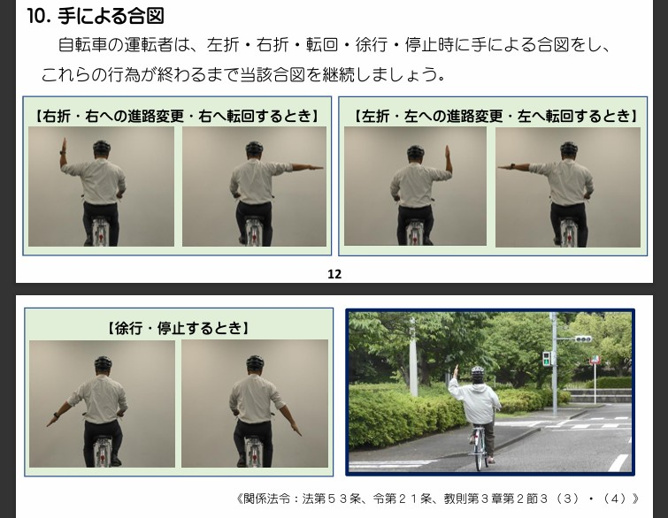
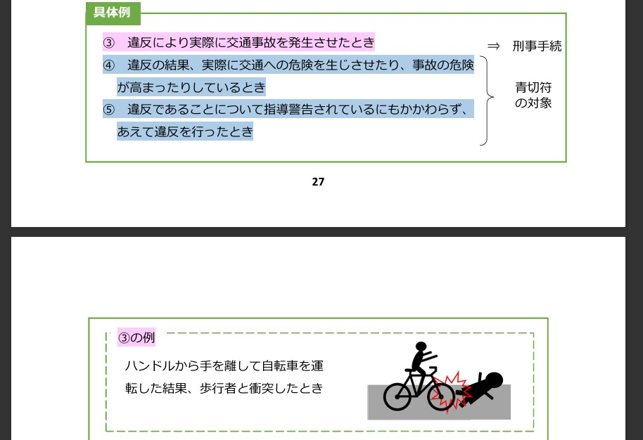

URL: [http://kensuke.github.io/misc/bicycles/](http://kensuke.github.io/misc/bicycles/) > [R_rules](http://kensuke.github.io/misc/bicycles/R_rules.html) > [R_rules_053](http://kensuke.github.io/misc/bicycles/R_rules_053.html)
<hr />

## 合図不履行
これ、個人的に、自転車は原則車道通行がー例外歩道通行がー・・よりも大きいと感じる。

- 合図不履行 53-1,2
- 合図制限違反 53-4
- 5,000円

```
（合図）
第五十三条　車両（自転車以外の軽車両を除く。次項及び第四項において同じ。）の運転者は、左折し、右折し、転回し、徐行し、停止し、後退し、又は同一方向に進行しながら進路を変えるときは、手、方向指示器又は灯火により合図をし、かつ、これらの行為が終わるまで当該合図を継続しなければならない。
２　車両の運転者は、環状交差点においては、前項の規定にかかわらず、当該環状交差点を出るとき、又は当該環状交差点において徐行し、停止し、若しくは後退するときは、手、方向指示器又は灯火により合図をし、かつ、これらの行為が終わるまで当該合図を継続しなければならない。
３　前二項の合図を行う時期及び合図の方法について必要な事項は、政令で定める。
４　車両の運転者は、第一項又は第二項に規定する行為を終わつたときは、当該合図をやめなければならないものとし、また、これらの規定に規定する合図に係る行為をしないのにかかわらず、当該合図をしてはならない。

（罰則　第一項、第二項及び第四項については第百二十条第一項第六号、同条第三項）
第百二十条　次の各号のいずれかに該当する者は、五万円以下の罰金に処する。
六　第五十二条（車両等の灯火）第二項、第五十三条（合図）第一項、第二項若しくは第四項又は第五十四条（警音器の使用等）第一項の規定に違反した者
```

 千葉県警 ルールガイドブック

 警察庁 ルールブック

ネットの信頼のおける有識者によれば、ハンドサインの結果 ふらついたりして発生した事故は違法にならないらしい。（要確認）
<br />
<br />

### どうすんの・・
わかんね・・。ウィンカーを付けないのであれば、右折左折時はいったん自転車をおりて歩行者扱いになるとか？<br />
<br />
近々で気になる事例がたくさん載ってる警察庁ルールブックに書いてないよね。意図的・・なのでは？ 自転車警官もやってないような気がするし・・。（もっともそこまで見てないが）<br />
１１３ものルールうんたらあって、これは社会通念上黙殺ｒｙ
<br />
<br />

### 自転車用ウィンカー
少ないがあるにはある。あるにはあるが、法的には方向指示器としては認められていない？ｗ（要確認）
<br />
<br />

#### リンク
1. 千葉県警<br />
   1-1. [https://www.police.pref.chiba.jp/index.html](https://www.police.pref.chiba.jp/index.html) 千葉県警トップ<br />
   1-2. [https://www.police.pref.chiba.jp/trafficSafety/index.html](https://www.police.pref.chiba.jp/trafficSafety/index.html) 交通安全<br />
   1-3. [https://www.police.pref.chiba.jp/kotsusomuka/bicycle_safety.html](https://www.police.pref.chiba.jp/kotsusomuka/bicycle_safety.html) 自転車安全対策<br />
   1-4. [https://www.police.pref.chiba.jp/kohoka/traffic-safety_defend-05._00209.html](https://www.police.pref.chiba.jp/kohoka/traffic-safety_defend-05._00209.html) 自転車の交通ルール<br />
   1-5. [https://www.police.pref.chiba.jp/kotsusomuka/traffic-safety_defend-05.html](https://www.police.pref.chiba.jp/kotsusomuka/traffic-safety_defend-05.html) 自転車の交通ルール<br />
   1-6. [https://www.police.pref.chiba.jp/content/common/000070885.pdf](https://www.police.pref.chiba.jp/content/common/000070885.pdf) 安全・安心な自転車利用に向けて【自転車の交通ルールガイドブック】はこちら​（PDF形式：1,613KB）<br />
   1-7. （Ｗｅｂ屋のやってる感のせいで、リニューアル（笑）でＵＲＬ変わるだろうなあ・・）<br />
2. 警察庁<br />
   2-1. [自転車の安全利用の促進](https://www.npa.go.jp/bureau/traffic/bicycle/index.html)<br />
   2-2. [「自転車を安全・安心に利用するために」（自転車ルールブック）の作成について](https://www.npa.go.jp/bureau/traffic/bicycle/pdf/rulebook.pdf)<br />
<!-- 数字リストのネストがうまくいかない・・ こうじゃないよね？ -->
