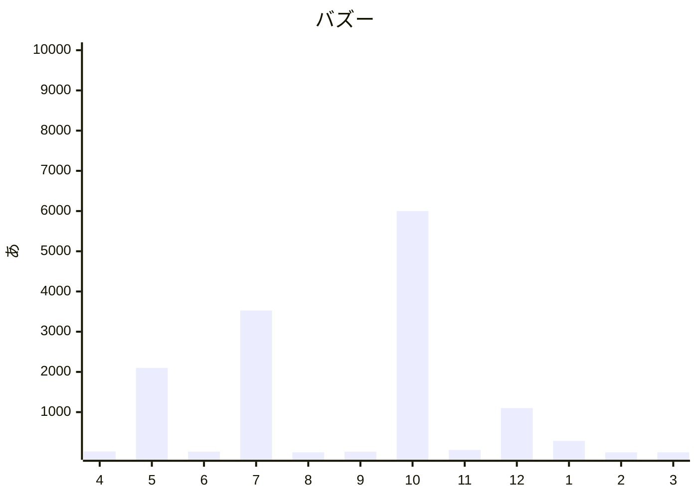

# インターネットが終わってる１０つの理由
（執筆中？）

### ネット民の反応
- [リアルタイム X検索 自転車 歩道](https://search.yahoo.co.jp/realtime/search?p=%E8%87%AA%E8%BB%A2%E8%BB%8A%20%E6%AD%A9%E9%81%93) 
めまいがする・・ 

  
コピペ、書き込みのたびにＩＤチェーンジ、キャッチボールにならないやりとり、 
 

### 天才インフルエンサー
<!-- 
https://twitter.com/hiiragi2280/status/1915870942179561646
震源地・・なのかなあ？
-->

- ２０２５年　４月　２６日　２２万
- 　５月　１０日　１８万　どこかの報道のスクショ、　３１日　２０９７万ｗ
- 　６月　５日　１２万、　８日　１４万 ・・ めんどくさくなってきたｗ、　１２日　７５２？ え？、　１３日　１４万、　１７日、　１８日
- 　７月　１０日　３５２７万ｗｗ、　２８日
- （ー夏休みー）
- 　９月　１８日、　１９日、　２４日
- １０月　５日　５９６７万！？ｗｗｗｗ、　２３日
- １１月　３０日
- １２月　１８日、　２７日、　７日 ノート？　１０８８万
  - （ソート順 日付順にしてるのに日付順にならない）
- ２０２６年　１月　２６日　２８５万
- 　２月　１５日時点で未確認ｗ　中旬～下旬か？
- 　３月　いよいよ翌月に控え、活発になることが予想されるｗ

４月に始まり、翌月には万どころか千万バズ、さらに翌々月に＋１５００万獲得し、、さらにさらに１０月には日本人の２人に１人は見てる計算に！？、１２月にようやくノート？がつくも年が明けてもやめられないとまるところを知らない・・

　ノ　ー　ト　っ　て　意　味　あ　ん　の　？

### コピペ保存
<!-- https://x.com/darekano1111/status/2022458575646527964 -->
> 標識があっても自転車は原則車道走行

これだからネットやめられないｗ
