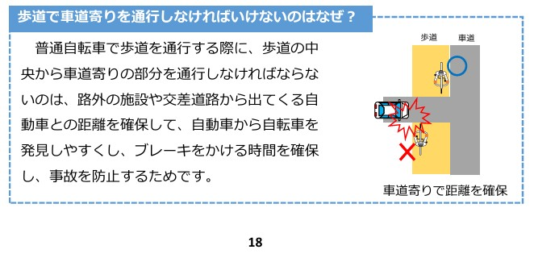

# 警察庁の歩道で車道寄りを通行しなければいけないのはなぜ？がイライラする

（執筆中）

- [警察庁 自転車の安全利用の促進](https://www.npa.go.jp/bureau/traffic/bicycle/index.html)
  - [「自転車を安全・安心に利用するために」（自転車ルールブック）の作成について](https://www.npa.go.jp/bureau/traffic/bicycle/pdf/rulebook.pdf)



路外の施設　駐車場と想定<br />
交差道路　自転車が一時停止しないで飛び出してきそう。

### 凡例
```
〇 歩行者
◇ 自転車
□　自動車

　　｜〇　┃
駐　｜歩　┃□ 車
車□ ｜道　┃　道
場　｜　◇┃
　　｜　　┃
```

### 理想
```
　　｜　　┃
駐　｜　　┃　車
車□→｜　◇┃　道
場　｜　　┃
　　｜　　┃
```
警察庁想定「距離を確保して、自動車から自転車を発見しやすくし、ブレーキをかける時間を確保し、事故を防止するため」<br />
反論：そもそもほぼほぼクリープでしょ
<br />
<br />

### だめ
```
　　｜　　┃
駐　｜　　┃　車
車□→｜◇　┃　道
場　｜　　┃
　　｜　　┃
```
警察庁「発見が遅れ、ブレーキが遅れ、接触してしまう！！」<br />
反論：あっ、はい
<br />
<br />

### げんじつ１
```
　　｜　　┃
駐　｜　　┃　車
車　｜→□ ┃　道
場　｜　↑┃
　　｜　◇┃
```
車道への出待ち一時停止してて、自転車の進行をふさいでる<br />
自転車側からの視点でいうと腹は立つ。が、車道の手前まで出ないと合流の安全確認ができないので仕方がない。街路樹とか視界の邪魔だしね。ってことはビッグモーターｒｙ
<br />
<br />

### げんじつ２
```
　　｜　　┃
駐　｜　　┃　
車　｜  ◇┃□←
場　｜　　┃
　　｜　　┃
```
さらに・・、駐車場から出てくる・・ではなく、駐車場に入ってくる車のほうが危ない。車道から入ってくる車は、対向車線等の車を見てて、流れが途絶えたときに入ってくる。ときに、歩道は見れてない。そこまで速度は出してないが、クリープでもない。どちらかというと流れが途切れた！行くぞってアクセルしてる
<br />
<br />

### イライラする・・
警察庁の想定があまりにもげんじつを見てなくてイライラする。ただ、データがある？のかも

- 車道へ出ようとするパターン１　ほぼほぼクリープでしょ？
- 車道へ出ようとするパターン２　車道手前で停止済み
- 車道から入ろうとするパターン　危険が危ない
<br />
